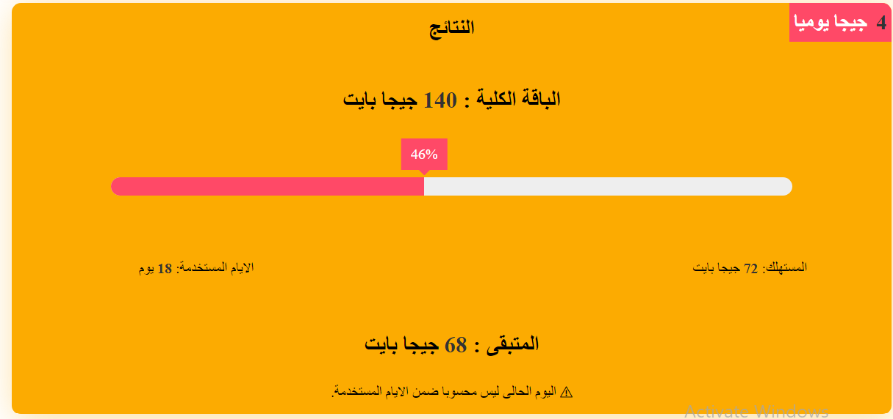

# Calculate Internet Usage. 
Calc Your Averge Month Use To Save You Quota (Vanilla Javascript).

## Preview Link:

Use the link to preview [Calculate Quota App](https://ali-sabry.github.io/calculate-quota).

## Table of contents
* [General info](#general-info)
* [Technologies](#technologies)
* [Preview Link](#Preview-Link)

# General info
The idea came to me when I was suffering from the end of the internet package before the end of the month, so I said why not make an application that helps me give the average daily consumption and the total value of the package, and the program calculates the rate of consumption, the rate of consumption and the rest of the rest.

Application Support Two Languages (Arabic - English).

## Technologies
Project is created with:
* HTML5.
* Css3.
* JavaScript : Es6.

# Lincess
******************************************************************/

* Author      : [Ali sabry](https://www.linkedin.com/in/ali-sabry/)
* Created     : 2021.

* All Copyright Reserved To Author [Ali sabry](https://www.linkedin.com/in/ali-sabry/)
